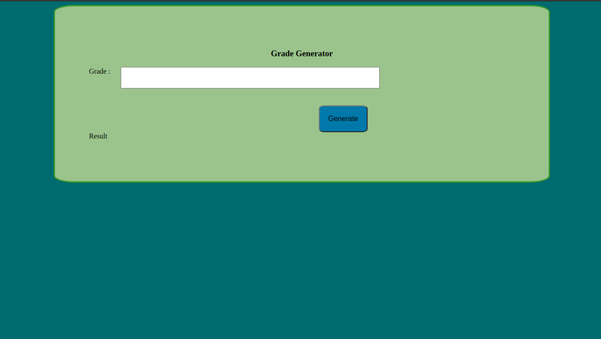
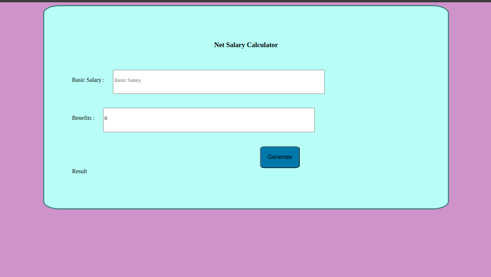

# WEEK 1 CODE CHALLENGE
----------

## Overall Project Description
----------
- You have a calculator performing different solution;
   1. Student grade generator
    2. Speed Detector
    3. Net Salary Calculator
----------

### User Operations
  - The user may input a value in any of the calculators
  - To get results from the calculator the user is required to click on the generate button
  - The operation is smooth and easy to use
----------  

#### Project preview

----------

----------

----------

##Languages and Framework
-----------
 -JavaScript
 -HTML
 -CSS

## Contributions
 Contributions are welcome on improving the project

## Live Site
 [acess project by clicking here](https://mjomba60.github.io/Phase-1-Week-1-code-challenge/)